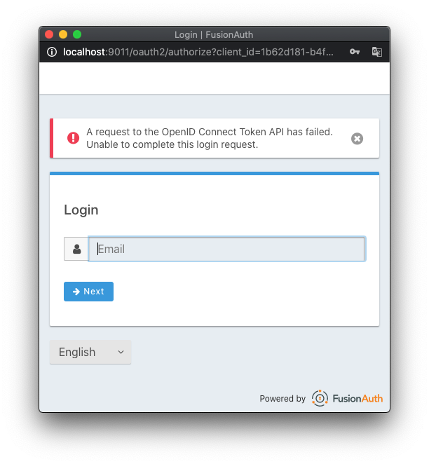

FusionAuth + VueJS + Docker
===============

Project developed to reproduce a fusionauth bug. All data for this project is not real. All project keys were generated randomly over the internet.

----------
### Initialize the project:

To start, clone the repository, cd to it and run the command below.

```bash
docker-compose up -d --build
```

----------
### Description of container ports:

- **8080** Used for the **VueJS** application.
- **9011** Used for **FusionAuth**.
- **5432** Used by **Postgres**.

----------
### How to access **FusionAuth** Dashboard:

After initializing the containers, access http://localhost:9011 with username: `lima@jhordan.com` and password: `jhordan123` to access FusionAuth dashboard.

----------
### Demonstrating the [**#1155**](https://github.com/FusionAuth/fusionauth-issues/issues/1155) issue:

After initializing the containers, access http://localhost:8080 and click on the `SSO Login` button. As soon as a PopUp opens, quickly fill in the user and password fields and then finish the login. An error like the image below is expected.



To bypass this error, it is necessary to wait an average of 30 seconds on the authentication screen of the identity provider.

----------
### Cause of the bug:

Whenever an identity provider is searched through their own domain using FusionAuth API even before an attempt to login to that IDP, this bug occurs.

API link: `http://localhost:9011/api/identity-provider/lookup?domain=email.com` 
